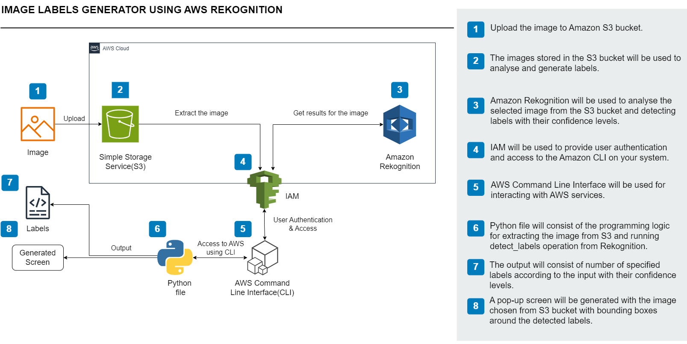
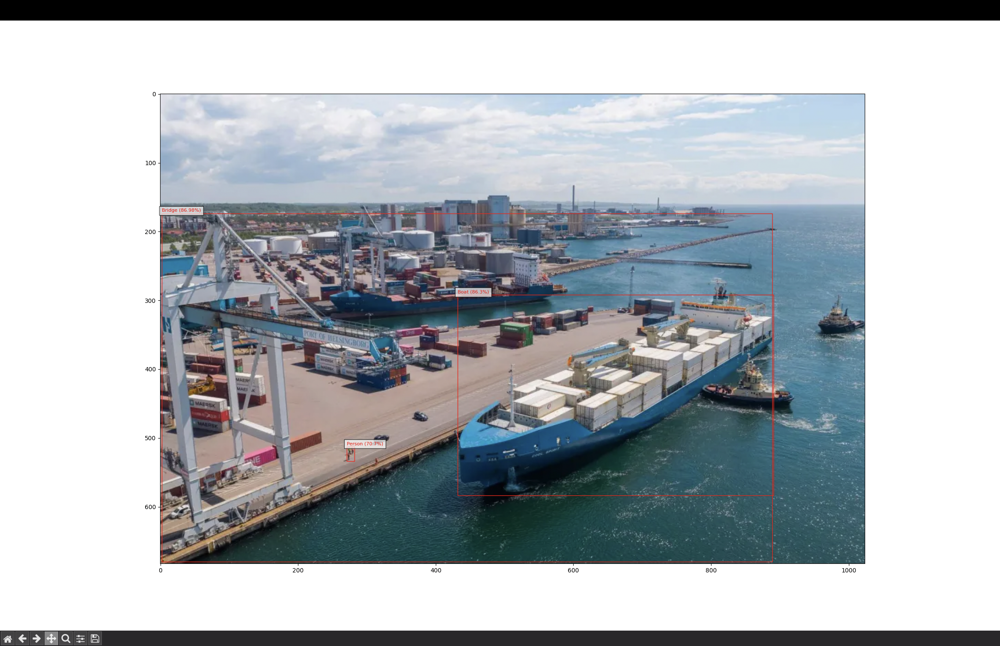

# Build an image labels generator using Amazon Rekognition

## Overview
Designed and implemented a serverless image analysis pipeline using **Amazon Rekognition** to automatically detect and label objects in uploaded images.  
Example: Upload a photo of a shipping port → system returns labels such as `Cargo Ship, Dock, Container`.

---

## Key Capabilities
- **Automated Image Processing:** Upload images to an Amazon S3 bucket, trigger analysis via Rekognition, and return descriptive labels.
- **Scalable & Serverless:** Uses AWS managed services to ensure high availability and zero infrastructure maintenance.
- **Command-Line & Programmatic Control:** Integrated AWS CLI for streamlined deployment and testing.

---

## Technical Workflow
1. **Amazon S3** – Secure image storage and retrieval.  
2. **Amazon Rekognition** – AI-driven image analysis and object detection.  
3. **AWS CLI** – Configured for seamless local-to-cloud operations.  
4. **Python** – Developed `detect_labels()` and `main()` functions for API interaction.  

---

**Process Steps:**
1. Create an S3 bucket for image uploads  
2. Upload images to the bucket  
3. Configure AWS CLI credentials and permissions  
4. Implement Python functions to interact with Rekognition  
5. Execute the script to process and label images  

---

## AWS Services Used
- **Amazon S3** → image storage  
- **Amazon Rekognition** → image analysis & labeling  
- **AWS CLI** → command-line interaction with AWS services  

---

## Architecture Diagram
This is what the architecture looks like

---

## Final Result
This is what your project will look like, once built:

