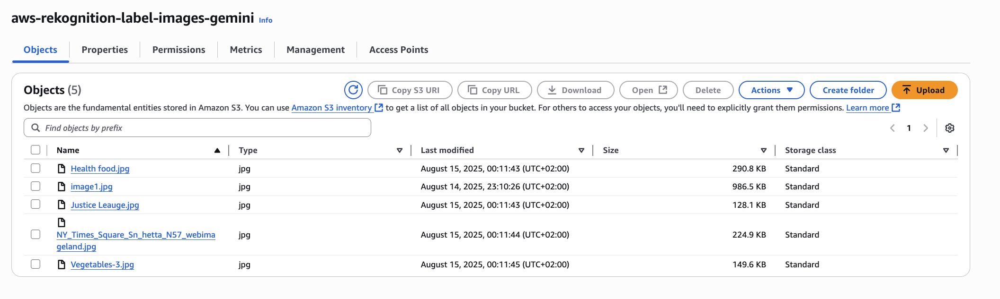
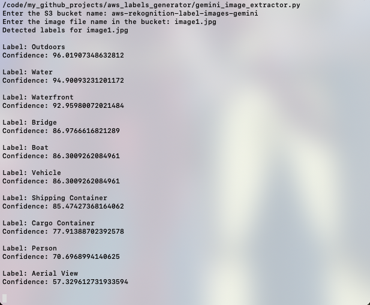

1. **Create an Amazon S3 Bucket**
Log in to the AWS Management Console and navigate to S3. Create a new bucket with a unique name and select the desired region. Upload sample images (preferably containing multiple objects) to this bucket, as these will be used for label detection.

2. **Installing the AWS Command line interface(CLI)**
Install AWS CLI on your system (Windows, macOS, or Linux) and verify the installation using aws --version. Next, create an IAM user in the AWS Management Console and attach the AmazonRekognitionFullAccess and AmazonS3ReadOnlyAccess permission policies. Generate an Access Key ID and Secret Access Key for this user. Finally, configure the CLI by running aws configure in terminal and entering the access key, secret key, default region, and output format.

3. **Importing Libraries**
Install the required Python libraries: boto3 for interacting with AWS services, matplotlib for visualization, and PIL for image processing. Import these libraries along with BytesIO in your Python script to handle image data efficiently.

import boto3
import matplotlib.pyplot as plt
import matplotlib.patches as patches
from PIL import Image
from io import BytesIO

4. **Define Image Label Detection Function:**
The detect_labels function takes a photo and S3 bucket name as inputs. It creates a Rekognition client using boto3, detects labels in the image, prints the labels with confidence scores, and displays the image with bounding boxes using PIL and matplotlib.

A main function is included to test detect_labels by specifying a sample photo and bucket name.

Note: The Python functional file implementing these functions is attached to this repository. 

5. **Run the Project:**
Execute the Python script in your terminal using python name_of_python_file.py. The script outputs the detected labels with confidence scores and opens a pop-up displaying the image with labeled bounding boxes.

6. **Conclusion:**
The Image Label Generator project demonstrates how to use AWS Rekognition with Python to detect labels in images stored in S3. It includes functionality for displaying images with detected labels and confidence scores.

This project can be extended to support video label detection, real-time object detection using live camera feeds, facial expression analysis, and face recognition. It provides a foundation for building more advanced applications using AWS services and Python.

